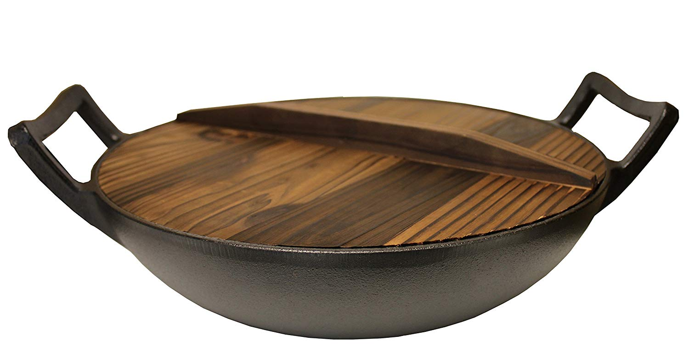
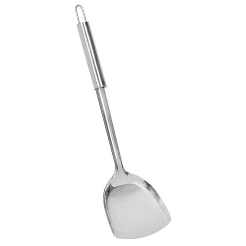

# Chinese Dishes[1]: 素什锦

I beg leave to explain the dish name 素什锦(su4 shi2 jin3) before describing its cooking process. 

素 means vegetarian diet, i.e. eating non-animal food. 素 is not equal vegetables, as what I presented ahead: gluten, mushroom, soybean and its products, fresh or dried vegetables, these are all 素. its antonym is 荤(hun1), means animal food, sometimes means dirty language.    

什锦 is a word with two Chinese characters, it means some different things mixed together. It can be used as a noun, like 素什锦, means some non-animal food getting together. It also can be used as a adjective, such as 什锦糖果(assorted candy), means many kinds of candy getting together.

##  Ingredient

1. Dehydrated gluten: 200g
2. Fried round gluten: 100g
3. Shiitake: 50g
4. Wood ear: 50g
5. Tremella: 50g
6. Dried yuba stick: 200g
7. Dried bamboo shoot: 100g
8. Dried daylily: 50g
9. Peanut: 100g

## Condiment

1. olive oil: 100g
2. aniseed: 1 
3. ginger: a few pieces
4. rice wine: 50g
5. soy sauce: 80~100g
6. suger: 50~80g
7. sesame oil: a little

## Preparation

1. Soak: 

   All ingredients except fried round gluten(item2) should be soaked in water for about 12 hours(one night), then wash them out and remove the extra water.

2. Cut:

   Some ingredients need to be cut so that every slice of cooked food can be easily picked up by chopsticks or fork and put into mouth all at once.  This is the priciple of cutting, actually you can cut them as your will and don’t mind these rules. Any way I will give my advice:

   *  cut item1(dehydrated gluten) to blocks with the length about 2.5cm; 
   * cut item2(round gluten) to two hemispheres;
   * cut item3(shiitake) to slice;
   * tear item4(wood ear) and item5(tremella) to suitable size;
   * cut item6(yuba stick), item7(bamboo shoot) and item8(daylily) to segment with length about 2.5cm;
   * remove the thin coat of item9(peanut), or let it be.

   Otherwise, cut ginger to slice,  tear aniseed into little pieces. 

3. Pan

   Recommend to use cast iron frying pan with cover so that the ingredients can be stir easily and stew for a long hours.

   
   *Cast Iron Frying Pan with Cover*

4. Cooking spade

   For stiring the ingredients, you should have a handy cooking spade like this.

   
   *Cooking Spade*

5. 

