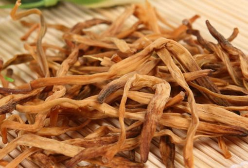

# Materials of Chinese Food:Dried Vegetables

We were living in another scene before the refrigerator was born. Vegetables was sown by season. In the harvest season, summer or autumn, a great amount of vegetables beyond the requirements were ripe in a short time. Fresh vegetables must be air dried so that they can be stored safely. In northern China, the dried vegetables help people getting through the long winter. 

But not all dried vegetables are made because of season. Actually dried vegetables have some special flavours then the fresh vegetables, a little bit like the smell of sunshine, soil and air, sometimes the smell of hometown. 

The refrigerator makes a lot of dried vegetables disappeared, the left ones are those which have special flavours.

## Dried Bamboo Shoot

Bamboo lives in southern China. The underground newborn bamboo is very tender, it is a kind of traditional food which has 3000 years history.  

*Dried Bamboo Shoot*

Fresh bamboo shoot can be steamed and air dried, dried bamboo shoot has some special flavours than the fresh and suit for long hours cooking with meat. 

Before cooking, dried bamboo shoot should be soaked in water for 1~2 days, then boiled with high fire for about 1~2 hours, then soaked in water again for 1~2 days by washing them twice a day avoiding rot. 

##  Daylily

As a kind of food, daylily is the flower bud of daylily. Fresh daylily is toxic, it’s inedibility. Dried daylily is safe for eating. Before cooking, dried daylily should be soaked in water for an hour. Daylily is seldom cooked alone, it is usually cooked with meat or scrambled eggs. It’s an essential ingredient of a traditional dish named 木须肉(Moo Shu Pork).

In Chinese cultrue, the daylily is also called Nepenthe, a kind of plant that can help getting rid of gloom. 

*Fresh Daylily*

*Dried Daylily*

## Dried Kelp

Kelp is a kind of edible seaweed. Fresh kelp should be dried in the sun. We can buy the dried kelp in supermarket all over the world.    

*Dry the Kelp in the Sun*

Dried kelp shoule be soaked in water for a while till it’s getting soft, then steamed or boiled for half an hour, after that soaking the cooked kelp in water waiting for the further cooking.   

Before cooking, kelp should be cut into strip or flaky。

*Soup of Kelp and Tofu*