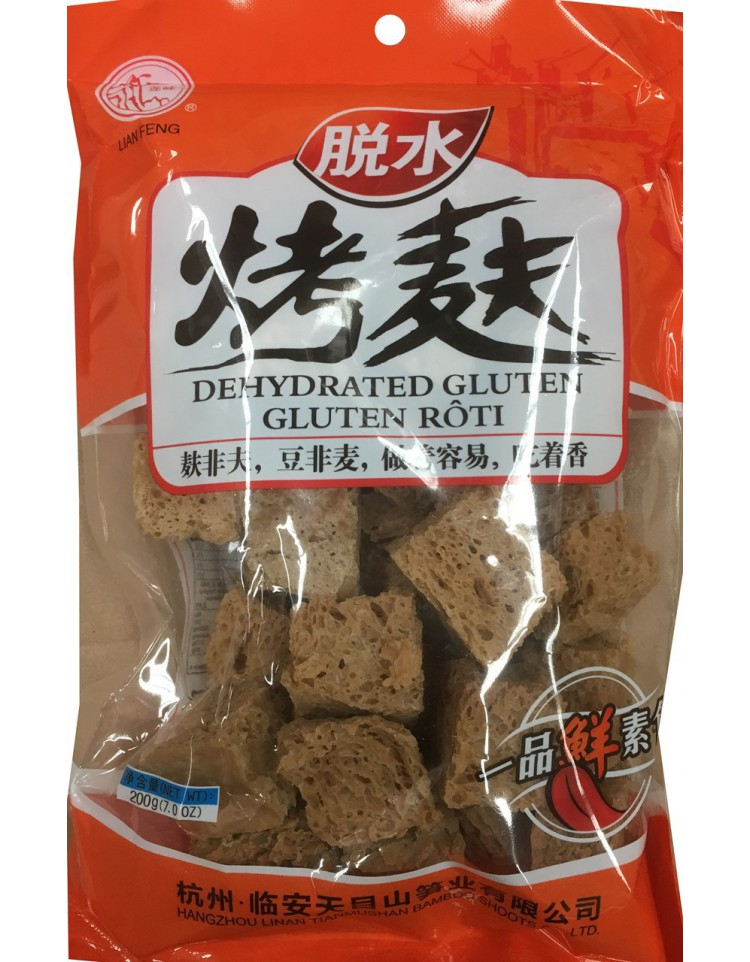

# Materials of Chinese Food:Dry stuff

1. Wheat Gluten(or Dehydrated Gluten, 烤麸)

Wheat gluten is made from gluten, the protein of wheat. Washing wheat flour dough with water until all the starch granules being removed, the gluten is left. But wheat gluten has its own special process craft, I don’t know the detail.

 *Packaged Wheat gluten*

Before cooking, the wheat gluten should be soaked in water for several hours until it’s getting soft. Like sponge, the wheat gluten is porous. When cooking, the broth with full of taste fill in the hole and the gluten become delicious.

2. Fried Round Gluten 
3. 