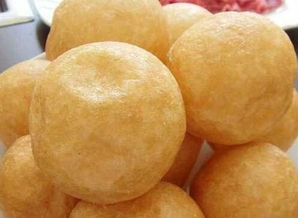

# Materials of Chinese Food:Gluten

## Dehydrated Gluten（烤麸)

Dehydrated gluten, or dry gluten, is made from wheat gluten, the main protein of wheat. Washing wheat flour dough with water until all the starch granules removed, the gluten is left. Blend wet gluten with a little bit of yeast, few hours later, steam the gluten and get the hydrated gluten. 

​		 *Packaged Wheat gluten*

Before cooking, the dehydrated gluten should be soaked in water for several hours until it’s getting soft, the dehydrated gluten becomes hydrated gluten. Like sponge, the hydrated gluten is porous. When cooking, the broth with full of taste fill in the hole and the gluten become delicious.

From 2013 to 2017, we three family members were on vegetarian diet and gluten is a kind of good resource of protein. It can be co-cooked with mushroom, skin of tofu, black fungus, white fungus and some kinds of dry vegetables such as lily flower.

## Fried Round Gluten(炸面筋) 

Like dehydrated gluten, the fry round gluten is made of fermented gluten. Round the gluten to a ball and fry it in middle temperature oil till it can keep the shape even if it’s cooled.

   
 *Fried Round Gluten*

As a kind of substitute of meat, fry gluten can be cooked with some vegetables, or fill some meatballs into the fry gluten balls and stew them.  

