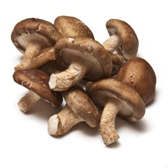
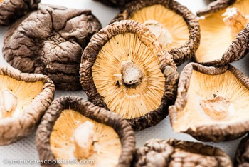
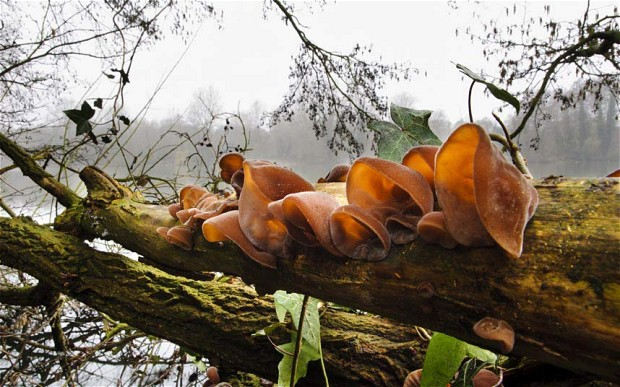

# Materials of Chinese Food:Mushroom

There are many kinds of edible mushroom in China, they seperately have their own names, such as shiitake, it's called Xianggu(香菇), means fragrant mushroom, it can be enjoyed by both nose and tongue. In China, the most common used mushroom are shiitake and wood ear, they are in almost every home kitchen.

## Shiitake

In supermarket, shiitake may be fresh or dry. Fresh shiitake can be cooked directly after cleanning and cutting. Dry shiitake must be soaked in water for several hours until it’s getting soft. To speak of the dry shiitake, It has a temping rich fragrance then fresh shiitake, it’s suit for long time cooking, or cooked with meat. 

 

​	*Fresh Shiitake*

*Dry Shiitake*

Shiitake is seldom cooked solely, it usually be cooked with other ingredients, such as chicken, vegetalbes and other mushroom. In vegetarian diet, shiitake can take place of meat, It’s a kind of source of protein. 

## Wood Ear(木耳)

Wood ear is a kind of fungus, it grows at the stem of dead wood. It looks like the ear of human so Chinese call it MuEr(木耳, 木 means wood and 耳 means ear).

*Living Wood Ear*

We can’t see the fresh wood ear in market. Farmers collect the fresh wood ears and sundried them. Before cooking, dried wood ear should be soaked in water for a while till it's getting soft. Notice the root of wood ear, there may be some impurity that should be removed.

Neither nose nor tongue can get some special feeling from wood ear whether it has been cooked. Why should we eat them now that we can’t feel anything from them？Except to make the dishes colourful, the most important reason is that wood ear will help to improve our health. You can find a long list of benefit of wood ear from internet. 

## Tremella(银耳)

In Chinese “银” means silver, a color nearly white. Tremella is also called white wood ear because its  shape looks like a wood ear, so the wood ear usually is called black wood ear.

Like wood ear, the tremella can’t be smelled and tasted weather it has been cooked. In traditional Chinese medicine, tremella is a drug to be good for lung.  Actrually it looks like the human’s lung.

Either wood ear or tremella, the simplest cooking is to long hours boil with soft fire, and sugar wiil be helpful for dissolving out the nutrition ingredient.  

​    

