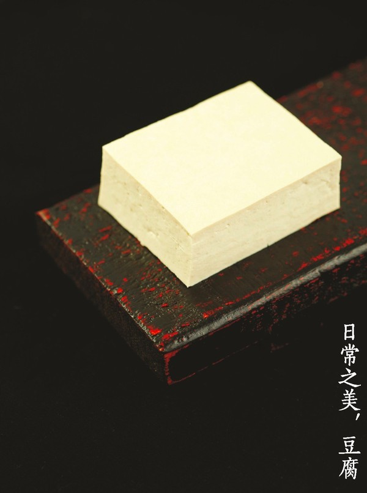
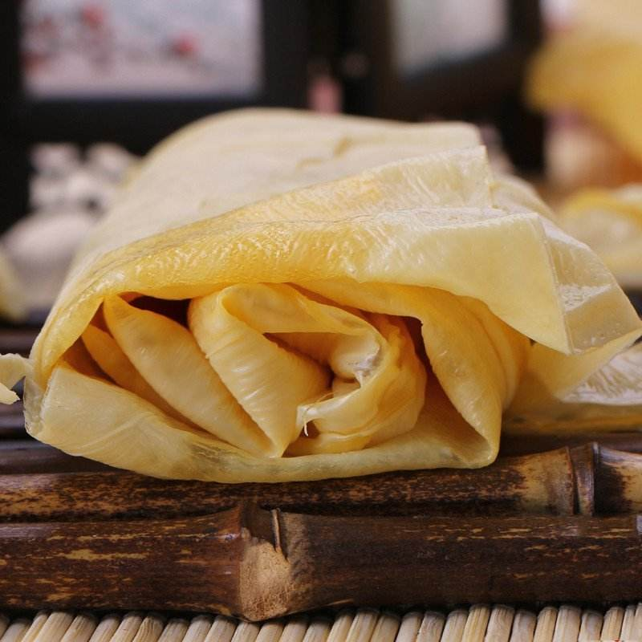
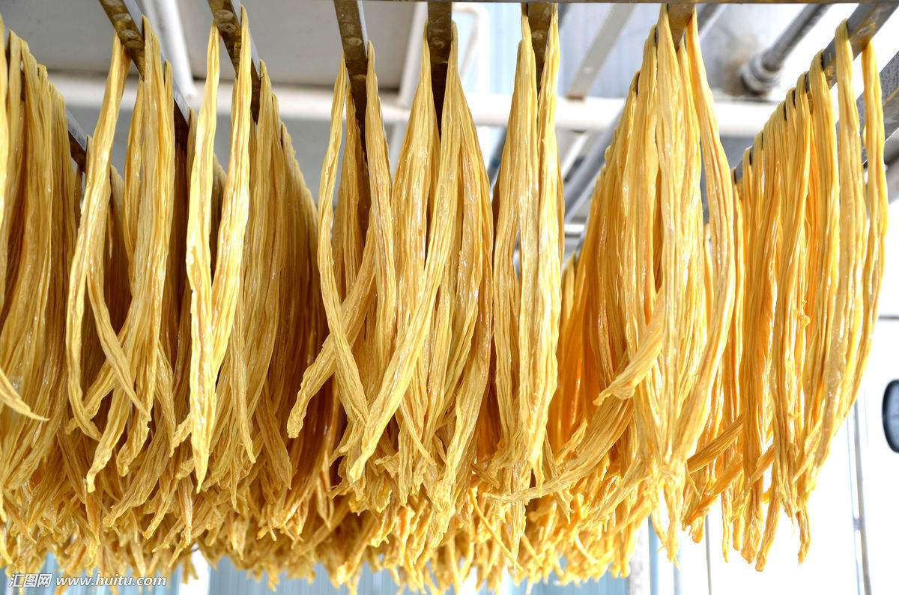
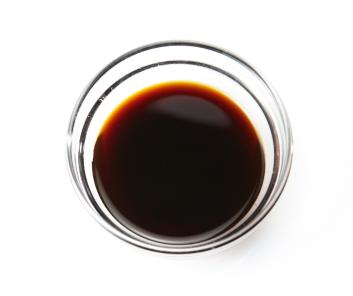
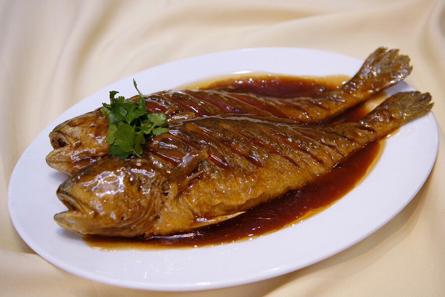

# Materials of Chinese Food:Soybean and its Products

Soybean is a gift of nature. It contains the complete protein. It can be made into many kinds of products to meet the needs of different people and different dishes. In China, common soybean products include tofu(豆腐), soy milk(豆浆), tofu skin(豆腐皮), soy sauce(酱油), soybean paste(豆酱), fermented bean curd(腐乳) and so on. They can be used as ingredient or served as condiment. 

## Tofu

**Tofu** is made from soy milk. Mix the boiling soy milk with coagulant, package the mixture with cotton gauze, press the package with weight while cooling, after the mixture cooled, the mixture becomes tofu. Making tofu is a traditional profession in China, some special processing crafts only be passed in family members. 

*Common and magic food: Tofu*

Tofu contains some elements of local water and soil. A person may be dyspepsia when he/she goes to a new place where is far away from hometown. He/she may eat some local tofu to ease the feeling of uncomfortable. 

Tofu can be cooked alone or with other ingredients. You can get various dishes by using different cooking method, such as salad, frying, soup, stew and so on. 

## Tofu skin

During the process of making tofu, when the soy milk was heated, some light materials float to the surface and form a piece of film which is called tofu skin. It is rich in protein and oil with the texture of meat or mushroom. It can serves as meat in vegetarian diet. 

*Tofu skin*

Befor cooking, tofu skin should be soaked in warm water for about an hour. It is suitable for stew.     

## Dried Yuba Stick

Tofu skin is the first layer that is lifted off from soy milk, it is eventrally dried to a piece. Below the first layer, there still are some floaters, lift and hang them up for drying, then we get the yuba sticks.  

*Drying Yuba Sticks*

Either tofu skin or yuba stick, they are all existing for about 500 years. As an agricultural nation, Chinese people are living on the soybean and its products.

## Fermented Soy Products

There are severial homely used fermented soy products, including soy sauce, soybean paste,  fermented bean curd and stinky tofu. They are all salt and served as condiment.

### Soy Sauce

Soy sauce can take the place of salt and give off more complex flavour.  In Japaness diet, Sashimi must be dipped in soy sauce which is mixed with masabi to rich the taste. In northern China, dumplings are dipped in vinegar and soy sauce which is mixed with mashed garlic and sesame oil.  

*Soy Sauce——riching the flavour and color of dishes*

### Soybean Paste

I lived in country with my grandparents when I was a child. I still remember that there was a jar which was full of fermented soybean paste in the yard. From time to time grandma  stirred the paste with a stick during the period of fermenting and the paste gave off a special smell. Many years later, I buy the bean paste from supermarket but I never meet the same smell again.

My grandma made the soybean paste in the open air without fermentation bacteria, but in factory, the paste is made in room and the fermentation bacteria is necessary.

In northern China, some uncooked fresh vegetables dipping in soybean paste is an everyday dish in summer.

Like soy sauce, soybean paste can serve as salt when cooking  with rich flavour and temping reddish brown color. 

*Braised croaker with soy sauce*

